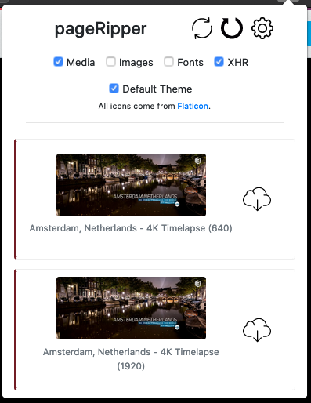

# Page Ripper

Page Ripper uses web listeners to detect objects and download them directly.
Supports:
- Audio, video, image and font files
- Video streaming: Vimeo support (currently not YouTube or M3U8 lists)

## Why?

Some objects are difficult to download, are under other objects, or not available on screen all the time.

## Download and installation

### From this repository

If you download the `pageripper-[version]-fx.xpi` file from the `web-ext-artifacts` folder, you can install according to the following instructions:

[https://extensionworkshop.com/documentation/publish/distribute-sideloading/#install-addon-from-file](https://extensionworkshop.com/documentation/publish/distribute-sideloading/#install-addon-from-file)

### Mozilla Firefox Add-on website (for developers)

If you are a registered Mozilla Firefox Add-on Developer, Mozilla Firefox Add-on website has a copy of the same `pageripper-[version]-fx.xpi` file. If you access it using Firefox and click on the link, Firefox will ask you if you want to install the extension:

[https://addons.mozilla.org/en-US/developers/addon/pageripper/](https://addons.mozilla.org/en-US/developers/addon/pageripper/)

## Configure

If you can't see the object you're expecting in the popup window:
- It might not be there
- You may have to refresh the page, so the extension can use listeners to read the connection
- You may have to enable the capture of specific objects, like media, images, etc. After checking the box, reload the page.

## Use

- Click on the extension icon
- On the popup window, locate your object
- Click the download button (cloud icon at the right of the object)
- If it's not there, check the previous section here (Configure)

### Toolbar

There are three buttons at the top of the popup window (check the screenshot at the bottom of this page):
- Reload the current page (icon: two arrows)
- Reload the extension (icon: one arrow)
- Open/close settings (icon: gear)

## Long-term usage

- You may keep the extension disabled while you're not using it. 
- When you need it:
    - Re-enable the extension
    - Check the configuration
    - Refresh the page 
    - Go to the popup window and locate the objects

## Permissions

Page Ripper requires the following permissions:
- activeTab
- tabs
- webRequest
- webRequestBlocking
- <all_urls>

### Personal Data

No personal data or device information is collected using this extension.

## Packing

If you want to pack the source code instead of installing the compiled extension, follow the instructions [here](https://extensionworkshop.com/documentation/publish/package-your-extension/). You can check the result of the command `web-ext build` in the folder `web-ext-artifacts`.

## Screenshot

### Popup window

